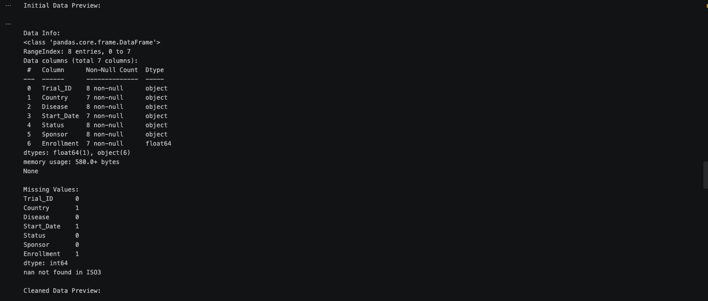
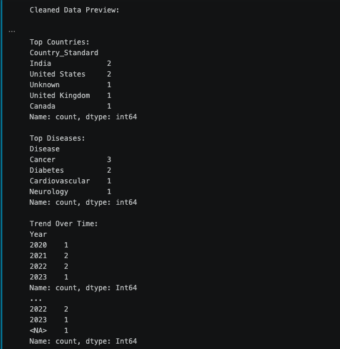
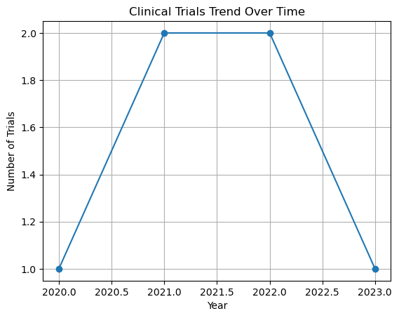
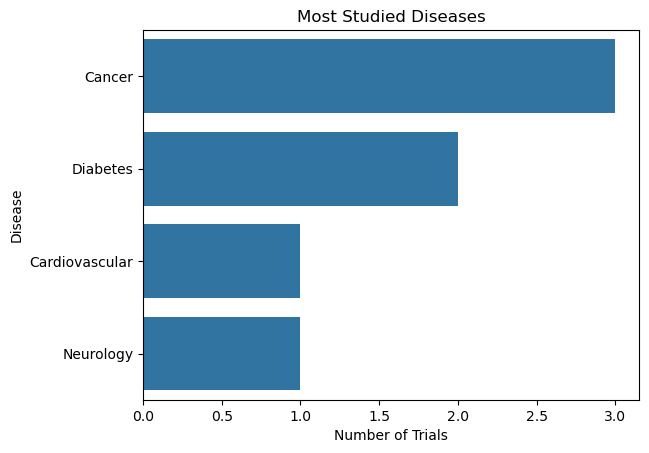
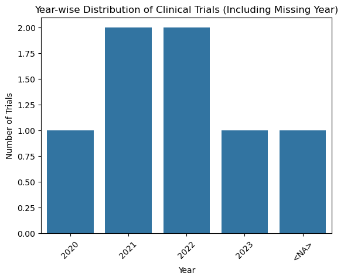
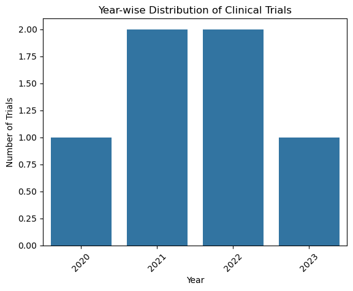
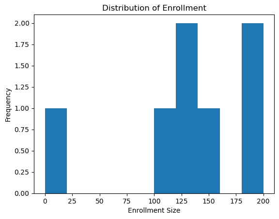

# 💊 Healthcare Clinical Trials Analysis

## 📖 Overview
This project analyzes global clinical trial data to identify trends in diseases, countries, and study activity over time.
The analysis demonstrates data cleaning, transformation, and exploratory data analysis (EDA) using Python.
This project demonstrates end-to-end data analysis, including data cleaning, transformation, and insight generation from a messy real-world dataset.

---

## 🎯 Objectives
- Clean messy real-world dataset
- Standardize inconsistent country names
- Handle missing values
- Analyze trends in clinical trials
- Visualize key insights

---

## 🚨 Problem Statement
Real-world datasets are often messy and inconsistent. This dataset contains issues such as:
- Inconsistent country names (e.g., "india", "India ", "USA")
- Missing values
- Mixed date formats
- Duplicate records with different IDs

---

## 🧹 Data Cleaning Steps
- Standardized country names using `country_converter`
- Handled missing values:
  - Country → "Unknown"
  - Enrollment → 0
- Converted mixed date formats into proper datetime
- Extracted Year from date for analysis
- Removed duplicate records based on relevant columns
- Reset index for clean dataset

---

## 💹 Analysis Performed
- Top countries conducting clinical trials
- Most studied diseases
- Trend of trials over time

---

## 📌 Key Insights
- Clinical trials are highly concentrated in a small number of countries, indicating uneven global research distribution
- Cancer and Diabetes are the most frequently studied diseases, reflecting global healthcare priorities
- Trial activity shows an increasing trend over time, suggesting growing investment in clinical research

---

## 🧰 Tech Stack 🛠️
- Python (Pandas, NumPy)
- Data Visualization (Matplotlib, Seaborn)
- Country Standardization (`country_converter`)

---

## 🗂️ Project Structure

```
healthcare-clinical-trials-analysis/
│
├── data/
│   │
│   ├── raw/
│   │   └── clinical_trials.csv
│   │
│   └── cleaned/
│       └── cleaned_clinical_trials.csv
│
├── notebooks/
│   └── healthcare_analysis.ipynb
│
├── outputs/
│   │
│   ├── general/
│   │   ├── 1.png
│   │   ├── 2.png
│   │   └── 3.png
│   │
│   ├── plots/
│   │   │
│   │   ├── bar/
│   │   │   ├── enrollment.png
│   │   │   ├── top_countries.png
│   │   │   ├── top_diseases.png
│   │   │   ├── yearwise_distribution.png
│   │   │   └── yearwise_distribution_missing_year.png
│   │   │
│   │   └── line/   
│   │       ├── trend_over_time.png
│   │       └── trend_over_time_missing_year.png
│   │
│   └── reports/
│
├── README.md
├── requirements.txt
└── LICENSE
```

---

## 🔍 Key Analysis

### 🌍 Top Countries Conducting Trials
-	Identified countries with highest clinical trial activity

### 🦠 Most Studied Diseases
-	Cancer and Diabetes dominate research focus

### 📉 Trend Over Time
-	Clinical trials show increasing trend over years

---

## 📂 Output

### 🖥️ General Overview




### 📈 Trend Analysis



### 📊 Distribution Analysis






- Cleaned dataset exported as:
  - `cleaned_clinical_trials.csv`

---

## 🧠 Key Learnings
This project highlights the importance of:
- Handling inconsistent real-world data
- Understanding data before analysis
- Working with missing values and formatting issues 
- Converting and extracting datetime features 
- Performing EDA and generating insights

---

## ⚠️ Note:
- Missing dates are included as a separate category (`<NA>`) to ensure transparency in analysis

---

## 👩‍💻 Author

**Sukriti Singh** 
🔗 GitHub: https://github.com/Sukriti-2609

---

## 📎 How to Run

1. Clone the reposi# 💊 Healthcare Clinical Trials Analysis

## 📖 Overview
This project analyzes global clinical trial data to identify trends in diseases, countries, and study activity over time.
The analysis demonstrates data cleaning, transformation, and exploratory data analysis (EDA) using Python.
This project demonstrates end-to-end data analysis, including data cleaning, transformation, and insight generation from a messy real-world dataset.

---

## 🎯 Objectives
- Clean messy real-world dataset
- Standardize inconsistent country names
- Handle missing values
- Analyze trends in clinical trials
- Visualize key insights

---

## 🚨 Problem Statement
Real-world datasets are often messy and inconsistent. This dataset contains issues such as:
- Inconsistent country names (e.g., "india", "India ", "USA")
- Missing values
- Mixed date formats
- Duplicate records with different IDs

---

## 🧹 Data Cleaning Steps
- Standardized country names using `country_converter`
- Handled missing values:
  - Country → "Unknown"
  - Enrollment → 0
- Converted mixed date formats into proper datetime
- Extracted Year from date for analysis
- Removed duplicate records based on relevant columns
- Reset index for clean dataset

---

## 💹 Analysis Performed
- Top countries conducting clinical trials
- Most studied diseases
- Trend of trials over time

---

## 📌 Key Insights
- Clinical trials are highly concentrated in a small number of countries, indicating uneven global research distribution
- Cancer and Diabetes are the most frequently studied diseases, reflecting global healthcare priorities
- Trial activity shows an increasing trend over time, suggesting growing investment in clinical research

---

## 🧰 Tech Stack 🛠️
- Python (Pandas, NumPy)
- Data Visualization (Matplotlib, Seaborn)
- Country Standardization (`country_converter`)

---

## 🗂️ Project Structure

```
healthcare-clinical-trials-analysis/
│
├── data/
│   │
│   ├── raw/
│   │   └── clinical_trials.csv
│   │
│   └── cleaned/
│       └── cleaned_clinical_trials.csv
│
├── notebooks/
│   └── healthcare_analysis.ipynb
│
├── outputs/
│   │
│   ├── general/
│   │   ├── 1.png
│   │   ├── 2.png
│   │   └── 3.png
│   │
│   ├── plots/
│   │   │
│   │   ├── bar/
│   │   │   ├── enrollment.png
│   │   │   ├── top_countries.png
│   │   │   ├── top_diseases.png
│   │   │   ├── yearwise_distribution.png
│   │   │   └── yearwise_distribution_missing_year.png
│   │   │
│   │   └── line/   
│   │       ├── trend_over_time.png
│   │       └── trend_over_time_missing_year.png
│   │
│   └── reports/
│
├── README.md
├── requirements.txt
└── LICENSE
```

---

## 🔍 Key Analysis

### 🌍 Top Countries Conducting Trials
-	Identified countries with highest clinical trial activity

### 🦠 Most Studied Diseases
-	Cancer and Diabetes dominate research focus

### 📉 Trend Over Time
-	Clinical trials show increasing trend over years

---

## 📂 Output

### 🖥️ General Overview


### 📈 Trend Analysis


### 📊 Distribution Analysis


- Cleaned dataset exported as:
  - `cleaned_clinical_trials.csv`

---

## 🧠 Key Learnings
This project highlights the importance of:
- Handling inconsistent real-world data
- Understanding data before analysis
- Working with missing values and formatting issues 
- Converting and extracting datetime features 
- Performing EDA and generating insights

---

## ⚠️ Note:
- Missing dates are included as a separate category (`<NA>`) to ensure transparency in analysis

---

## 👩‍💻 Author

**Sukriti Singh** 
🔗 GitHub: https://github.com/Sukriti-2609

---

## 📎 How to Run

1. Clone the repository  
2. Install dependencies:
   - pip install -r requirements.txt
3. Run the notebook in Jupyter or Kaggle 
tory  
2. Install dependencies:
   - pip install -r requirements.txt
3. Run the notebook in Jupyter or Kaggle 
